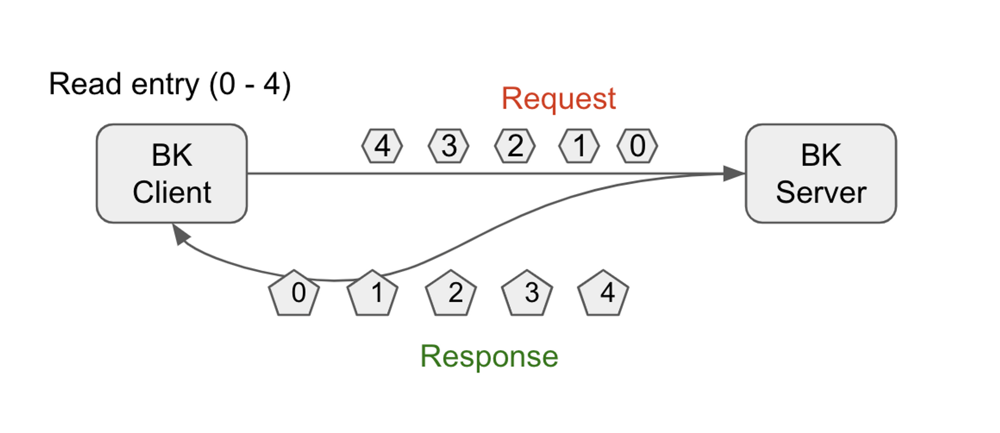
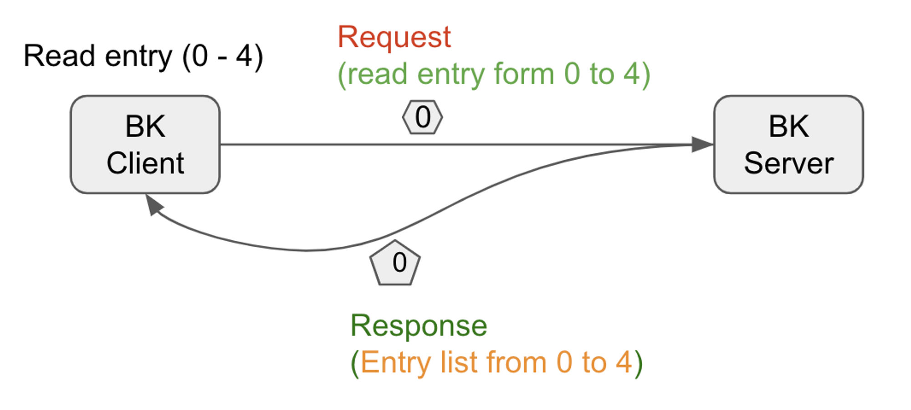

# BP-62 New API for batched reads

# Motivation

The BookKeeper client has provided an API [0] that allows for the efficient reading of entries [1] from bookies. 
While users can specify a start and end entry ID for a ledger [2] according to the API's definition, 
the reality is that the bookie server can only read a single entry at a time. Consequently, the BookKeeper client is 
required to send a request for each entry to the bookies based on the user-specified start and end entry IDs. 
This approach is highly inefficient and can result in significant CPU resource consumption, especially when reading a 
large number of entries. The frequent RPC calls to the bookies also put a heavy burden on the bookie server, which must 
process read requests from the IO thread and subsequently jump to the entry read thread pool.



A more effective way to read entries is to use one RPC request to read multiple entries at once. This approach will 
significantly reduce the number of RPC calls, thread jumps, and enqueue and dequeue operations of the thread pool.


To demonstrate this point, I have conducted a simple benchmark test using the BookKeeper perf tool to compare batch 
and individual entry readings. The test case was repeated to read the data from the same ledger and to avoid the impact 
of disk performance on test results, the entries were read from the cache since the batch read protocol change would not 
introduce any disk read improvements. The results show that using the batched entry read API provides a remarkable 
10x performance improvement.

Here is the output of the BookKeeper perf tool with ensemble=1, write=1, and ack=1.
```text
Batch(100): Read 1000100 entries in 8904ms
Batch(500): Read 1000500 entries in 12182ms
Non-Batch: Read 1000130 entries in 199928ms
```
The key difference with the batch read is that the BookKeeper client sends only 10,000 requests to the server 
(compared to 1,000,000 in non-batch read), and the server sends 10,000 responses back to the client (versus 1,000,000 in non-batch read).
This approach reduces the number of RPC calls made and eliminates the need for the server to process a large number of 
requests from the IO thread and the entry read thread pool, resulting in a significant improvement in performance.

Hence, the objective of this proposal is to enhance the performance of entry reading by introducing a batch entry reading protocol 
that takes into account the expected count and size of entries.
- **Optimize entry reading performance:** By reading multiple entries in a single RPC request, the network communication and RPC call overhead can be reduced, thereby optimizing the reading performance.
- **Minimize CPU resource consumption:** The aggregation of multiple entries into a single RPC request can help in reducing the number of requests and responses, which in turn can lower the CPU resource consumption.
- **Streamline client code:** The ability to read entries based on the anticipated count or size, such as Apache Pulsar's approach of calculating the start and end entry IDs for each read request based on the average size of past entries, can add unnecessary complexity to the implementation and can't guarantee reliable behavioral outcomes.

# Public Interfaces

## BookKeeper Client API
1. The new APIs will be added to BookieClient.java
```java
default void readEntries(BookieId address, long ledgerId, long startEntryId,
        int maxCount, long maxSize, BatchedReadEntryCallback cb, Object ctx,
        int flags) {
        readEntries(address, ledgerId, startEntryId, maxCount, maxSize, cb, ctx, flags, null);
        }
default void readEntries(BookieId address, long ledgerId, long startEntryId,
        int maxCount, long maxSize, BatchedReadEntryCallback cb, Object ctx,
        int flags, byte[] masterKey) {
        readEntries(address, ledgerId, startEntryId, maxCount, maxSize, cb, ctx, flags, masterKey, false);
        }
        
        void readEntries(BookieId address, long ledgerId, long startEntryId,
        int maxCount, long maxSize, BatchedReadEntryCallback cb, Object ctx,
        int flags, byte[] masterKey, boolean allowFastFail);
        
        void readEntiesWithFallback(BookieId address, long ledgerId, long startEntryId,
        int maxCount, long maxSize, BatchedReadEntryCallback cb, Object ctx,
        int flags, byte[] masterKey, boolean allowFastFail) 
```
2. The new class BatchedReadEntryCallback will be added to BookkeeperInternalCallbacks.java
```java
public interface BatchedReadEntryCallback {
    void readEntriesComplete(int rc, long ledgerId, long startEntryId, ByteBufList bufList, Object ctx);
}
```
3. The new APIs will be added to ReadHandle.java
```java
CompletableFuture<LedgerEntries> readAsync(long startEntry, int maxCount, long maxSize);

default LedgerEntries read(long startEntry, int maxCount, long maxSize) throws BKException, InterruptedException {
        return FutureUtils.result(readAsync(startEntry, maxCount, maxSize),
        BKException.HANDLER);
        }
```
## Wire protocol changes

In BookKeeper, the V2 protocol uses a custom encoding format. So we need to handle the data encoding and decoding. 
The V3 protocol uses the ProtoBuf for encoding and decoding.

### V2 Protocol

The new command type *`BATCH_READ_ENTRY`* will be added to [BookieProtocol.java](https://github.com/apache/bookkeeper/blob/master/bookkeeper-server/src/main/java/org/apache/bookkeeper/proto/BookieProtocol.java)
```java
byte BATCH_READ_ENTRY = 7;
```
The new command BatchedReadRequest will be added to BookieProtocol.java
```java
class BatchedReadRequest extends ReadRequest {
    long requestId;
    int maxCount;
    long maxSize;
}
```

And the command BatchedReadRequest will be encoded as
```java
| 4 bytes (frame_size) | 4 bytes (header_size) | 4 bytes (packet_header) | 8 bytes (ledger_id) | 8 bytes (start_entry_id) | 8 bytes (request_id) | 4 bytes (max_count) | 8 bytes (max_size) |
```

The new command `BatchedReadResponse` will be added to [BookieProtocol.java](https://github.com/apache/bookkeeper/blob/master/bookkeeper-server/src/main/java/org/apache/bookkeeper/proto/BookieProtocol.java)

```java
class BatchedReadResponse extends Response implements ReferenceCounted {

    final long requestId;
    final ByteBufList data;
}
```

The new command `BatchedReadResponse` will be encoded as

```java
| 4 bytes (frame_size) | 4 bytes (response_size) | 4 bytes (packet_header) | 4 bytes (error_code) | 8 bytes (ledger_id) | 8 bytes (start_entry_id) | 8 bytes (request_id) | 4 bytes (payload_size) | payload |  4 bytes (payload_size) | payload | ... |
```

### V3 Protocol

The new Operation Type *`BATCH_READ_ENTRY`*  will be added to the [OperationType enum](https://github.com/apache/bookkeeper/blob/master/bookkeeper-proto/src/main/proto/BookkeeperProtocol.proto#L55-L69)

```java
BATCH_READ_ENTRY = 12;
```

The new command will be added to [BookkeeperProtocol.proto](https://github.com/apache/bookkeeper/blob/master/bookkeeper-proto/src/main/proto/BookkeeperProtocol.proto)

```java
message BatchReadRequest {
    enum Flag {
        FENCE_LEDGER = 1;
        ENTRY_PIGGYBACK = 2;
    }
    optional Flag flag = 100;
    required int64 ledgerId = 1;
    // entryId will be -1 for reading the LAST_ADD_CONFIRMED entry.
    required int64 startEntryId = 2;
    required int32 maxCount = 3;
    required int64 maxSize = 4;
    // Used while fencing a ledger.
    optional bytes masterKey = 5;
    // Used for waiting on last add confirmed update
    optional int64 previousLAC = 6;
    // Used as a timeout (in milliseconds) for the long polling request
    optional int64 timeOut = 7;
}

message BatchReadResponse {
    required StatusCode status = 1;
    required int64 ledgerId = 2;
    required int64 startEntryId = 3;
    repeated bytes body = 4;
    // Piggyback LAC
    optional int64 maxLAC = 5;
    optional int64 lacUpdateTimestamp = 6;
}
```

# Proposed Changes

## Loose constraints

The definition of the batched read API does not strictly adhere to the maximum count and size constraints defined by the 
request parameters. Rather, the API may return fewer entries than what was requested within the bounds of the established range. 
For instance, if the caller requests to read 100 entries from the bookie server, the API may return any number of entries
up to and including 100. The API is designed as loose constraints for the following reasons

1. **Ensemble change:** The read entries may be distributed across different bookies after *Ensemble Change* [3]. 
To cope with the impact of ensemble change, the BookKeeper client has to send multiple requests to different bookies when 
reading entries and then merge the returned results to return to the user. If a request times out, the BookKeeper 
client has to discard the other returned results and provide feedback to the caller. Compared to the complexity introduced for the client, 
the benefits are almost negligible since ensemble change is not happening all the time.
2. **A < W:** If *Ack Quorum* < *Write Quorum* [3], some of the bookies may not have all the data that was successfully 
written by the clients. Therefore, if a request is sent to bookies that do not have all the data the client successfully 
wrote, the returned entries may also be missing some of the trailing data. We can have two ways to try to satisfy the 
read size requirement 
as much as possible
    a. Discard the already read data and send the request to another bookie.
    b. Read the missing parts from another bookie and then merge the results to return to the caller.

But both options come with additional costs or added complexity for the bookkeeper client. And the API will not 
return 0 entries or EntryNotFoundException to the caller if the first request entry ID is lower than the *LAC* [3]. 
The bookie client would retry to another bookie to read the entries if the requested bookie returned EntryNotFoundException.

3. **Exceeds the Netty’s frame size:** The bookie server cannot send data larger than the Netty’s frame size.

In conclusion, defining the maximum read entries count and size in the new API as loose constraints would simplify the client. 
For the API caller, it is only necessary to decide which entry to read from the entries that have already been read without
worrying about whether the read entries meet the expected entries count or size of the request.

## Not supporting striped Ledger

Regarding what bookkeeper striped writes are, please refer to the section of *Layer 2 - Logical Storage Model of the post* [4]. 
As no single bookie can have the complete set of written data, it poses a significant challenge to perform batch reads. 
The client has to read from multiple bookies and merge the results to return to the caller. One possibility is the API 
can be defined as reading multiple entry IDs. The caller provides a list of entry IDs. The bookie client splits into 
multiple requests based on provided entry IDs for each bookie and then merges the returned results from multiple bookies 
before returning them to the caller. Considering the following reasons, we should not define the API like this.

1. The implementation of the client becomes more complicated.
2. From my experience, striped writing is not commonly used. We should not add overhead to common scenarios for less 
frequently used ones, especially if it means that the request body containing the entry ID list becomes larger. 
This mainly refers to the fact that including an entry ID list in the request will inflate the network transmission.
3. The bookie server must return the data according to the defined entry IDs. If one entry is missed on the bookie, 
the bookie must return EntryNotFoundException to the bookie client so that the bookie client can request another bookie. 
Otherwise, the API definition will become confusing.

So, the bookie client will fall back to the current way of reading a single entry at a time to a bookie and merging all 
the results from the bookies if the *Ensemble size* is greater than the *Write Quorum*.

For the fallback, we have two options:

- Use the batch-read API to read entries, but bookie servers will return one entry in each read request. After the entry 
is returned, the client will send the next read request to the bookie servers. This way can unify caller API to batch-read 
but will introduce a huge read performance impact due to the next read request won’t be sent to the bookies until the 
previous read response is returned.
- Provide a fallback extended batch-read API. If the ledger is stripped, the batch-read API will automatically fall back 
to the single-read API internally. The fallback batch-read API is an extension of the batch-read API, and it can fall 
back to single-read API internally on demand.

We will choose the fallback batch-read API solution. This solution can provide the simplest way to support reading stripped 
ledgers in the unified batch-read API and users don’t need to care about the compatibility issues.

# Compatibility

Considering the introduction of wire protocol changes in the proposal, there is a possibility of compatibility issues arising
if the client is upgraded without upgrading the server. This could result in potential errors and unexpected behavior. 
To prevent any losses for the users, there are two options available. However, it is important to note that this is a newly
introduced API and not a modification of any existing APIs. The compatibility issue being referred to is specifically 
related to the definition of the new API when used with an old version bookie server. It is worth mentioning that the 
proposed changes will not break any existing APIs or alter the behavior of any existing APIs.

1. **Default batch-read API returns error codes directly.** The BookKeeper protocol has established the "invalid request type" 
error [5] to handle cases where a client sends a request to a bookie server that does not support batch reading. Consequently, 
the client will receive a "NotSupport" error and must decide whether to switch to single-entry read mode. While this approach 
offers more deterministic behavior for the new API, ensuring that callers are informed of the ultimate behavior whether or not 
the server supports it, it does require all callers to handle the issue of unsupported API.
2. **Fallback-supported batch-read API will fallback to single-entry read automatically.** By letting the bookie client 
handle the issue of server support for the batch read protocol, the batch read API will not fail when the server does not
support it. This decouples the client batch API from the server protocol, meaning that users do not need to worry about 
whether the bookie server supports batch reading or not. However, this may be confusing for users as they may not receive
a clear indication that the server does not support the new API. Users expect to achieve better performance by using the new API,
but if the server has not been upgraded, the new API may not perform as expected.

In order to make batch-read API definition and behavior clear, we provide the batch-read API and fallback-support batch-read API. 
The default batch-read API returns error codes to the user directly and let the user determine what action to do. The fallback-supported
batch-read API will handle the unsupported cases internally and the user won’t receive any alerts if the bookie server does not support 
batch-read API or reading to the stripped ledgers.

The proposal aims to define the behavior of the new API through the **second approach**, primarily due to the following reasons:

1. The responsibility of handling fallback to single-entry read mode for Ledgers with stripped writing should belong to 
the bookie client, as stripped writing is not part of the public API of BookKeeper. Therefore, it is necessary to maintain
consistent behavior across all BookKeeper clients.
2. To avoid users from making redundant efforts to handle protocol compatibility, the client should handle the issue of 
unsupported API rather than leave it to the users.
3. If applications such as Pulsar want to migrate from single-read API to batch-read API, they need to change the whole 
read logic because the batch read API is different from the single read API, because the constraints of the batch read API
are loose, and single read API is strict. If the applications switched from single-read API to batch-read API by changing 
the code logic, we need a way to switch back to single-read API. One solution is to maintain both single-read API and 
batch-read API on the application side, and another solution is to provide a flag on the BookKeeper client side, and fallback
to single-read API if the flag is enabled. We prefer to control it on the BookKeeper client side because it will simplify the
application logic a lot when switching from single-read API to bath-read API.

In conclusion, detailed documentation should be provided to explain the API's behavior, particularly in cases where it 
falls back to single-item read mode. This will help users set reasonable expectations for the new API and avoid confusion.

# Operability Considerations

Even if users have upgraded the BookKeeper server and client, modified their code to use the new API for better read 
performance. However, the new API may also introduce new risks. It could be an increased resource consumption in specific
scenarios or a bug that causes the API to malfunction in certain cases. Therefore, users need to have a quick option to
go back to the old way when problems arise, rather than only being able to resolve them through rollbacking the application.


The fallback-supported batch-read API provided a flag to fall back to the old behavior. We control the flag on the 
BookKeeper client side can simplify the application logic a lot when switching from single-read API to bath-read API.

# Security Considerations

No security issues that we need to consider for this proposal. It will follow the existing security pattern.

# Observability

To increase visibility into the new functionality of the bookie server, we need to add the following metrics to the bookie server

| Indicator | Type | Description |
| --- | --- | --- |
| bookkeeper_server_BATCH_READ_ENTRY_REQUEST | Histogram | The histogram of the batch read requests
latency buckets: [0-5], [5-10], [10, 20], [20-50], [50-100], [100-200],[200-500],[500-1000], [1000-3000], [>3000] |
| bookkeeper_server_BATCH_READ_ENTRY_RESPONSE_SIZE | Histogram | The histogram of the batch read response size
Size buckets: [0-128], [128-512],[512-1k],[1k-2k],[2k-4k],[4k,16k],[16k-128k],[128k-1MB], [> 1MB] |


# References
[0] https://bookkeeper.apache.org/docs/api/ledger-api#reading-entries-from-ledgers
[1] https://bookkeeper.apache.org/docs/getting-started/concepts#entries
[2] https://bookkeeper.apache.org/docs/getting-started/concepts#ledgers
[3] https://jack-vanlightly.com/blog/2021/12/7/tweaking-the-bookkeeper-protocol-guaranteeing-write-quorum
[4] https://jack-vanlightly.com/blog/2018/10/2/understanding-how-apache-pulsar-works
[5] https://github.com/apache/bookkeeper/blob/master/bookkeeper-server/src/main/java/org/apache/bookkeeper/proto/BookieProtocol.java#L151